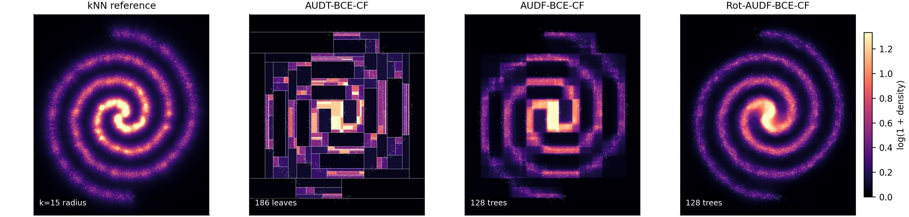

# AUDT_IAS

`audt_ias` is a python package that contains the analytic unary density tree/forest code used for the paper "Analytic Unary Density Trees for Inspectable
Anomaly Scoring" (submitted to [SpacSec 2026](https://spacsec.itmo.ru/)):

- `UnaryDensityTree`: a single analytic unary density tree (AUDT).
- `UnaryDensityForest`: bagged unary density trees, including random and PCA
  rotation forests. The default configuration is a reasonably strong
  random-rotation forest.
- `UnaryDensityBayesClassifier`: a binary classifier built from two
  class-conditional unary density estimators.

Although the proposed tree-building mechanism is based on a gradient-based approach, it requires accounting for leaf volume during construction; unfortunately, this prevents implementing the method as an extension of [`gradient_growing_trees`](https://github.com/NTAILab/gradient_growing_trees). Nevertheless, this implementation is quite efficient thanks to the use of Numba and the reuse of a pre-allocated buffer to store data information during tree construction. 



## Installation

From this directory:

```bash
python -m pip install -e .
```

Required runtime dependencies are `numpy`, `scikit-learn`, and `joblib`.
If `numba` is already installed, split search kernels are JIT-compiled
automatically; otherwise the package uses a pure Python fallback.

## Quick Start

```python
import numpy as np

from audt_ias import UnaryDensityForest

rng = np.random.default_rng(0)
X_train = rng.normal(size=(500, 2))
X_test = np.array([[0.0, 0.0], [3.0, 3.0]])

model = UnaryDensityForest(random_state=0)
model.fit(X_train)

density = model.score_samples(X_test)
anomaly_score = -model.score_log_samples(X_test)
```

The estimators follow the scikit-learn API: `fit`, `score_samples`,
`score_log_samples`, `predict`, and `apply`.

## Main Parameters

- `loss`: `"mse"` or `"bce"`. BCE also supports `bce_solver="approx"`,
  `"closed_form"`, or `"fixed_point"`.
- `bounds`: optional modeling domain with shape `(2, n_features)`. If omitted,
  bounds are inferred from training data with `bounds_margin`.
- `leaf_value_mode`: `"path"` keeps accumulated split-path values;
  `"refit"` recomputes final leaf densities from leaf mass and volume.
- `rotation`: in `UnaryDensityForest`, use `False`, `"random"`, or `"pca"`;
  the default is `"random"`.
- `density_aggregation`: `"mean_density"` or `"mean_log_density"` for forests.

The default forest uses 256 random-rotation trees, `max_depth=14`,
`max_samples=0.8`, `min_samples_leaf=3`, MSE unary loss, `l2_reg=1e-3`, and
leaf refitting.
The default single tree uses `max_depth=14`, BCE closed-form leaf values, and
leaf refitting.

See `examples/` for runnable scripts.
